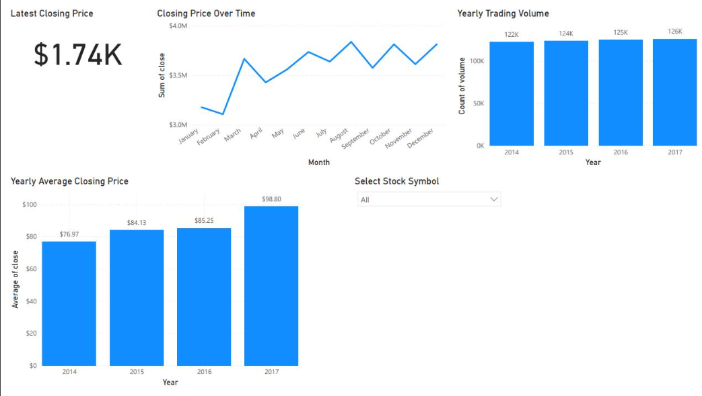

# S&P 500 Stock Market Analysis (2014-2017)

A Power BI dashboard analysing S&P 500 stock performance between 2014 and 2017, tracking closing price trends, trading volumes, and yearly averages across the index.

Note: The original .pbix file is no longer available. This repo showcases the dashboard through a screenshot, along with a summary of the approach and key insights.

---

## Project Objective

To analyse S&P 500 stock price movements from 2014 to 2017, surfacing closing price trends, trading volume patterns, and year-on-year growth to support a clearer read on market performance over the period.

---

## Data Source

S&P 500 historical stock price dataset, 2014-2017, covering daily ticker, volume, high, low, open and close prices — [S&P 500 Stock Prices dataset, Maven Analytics](https://mavenanalytics.io/data-playground/s-p-500-stock-prices) (source: The Investor's Exchange).

---

## Tools & Skills Used

| Stage | Tools |
|---|---|
| Data cleaning & transformation | Power Query |
| Data modelling | Power BI |
| Calculated metrics | DAX (KPI cards, yearly aggregations) |
| Dashboard development | Power BI Desktop |
| Interactivity | Stock symbol slicer |

---

## Dashboard Overview

- Latest Closing Price: $1.74K
- Closing Price Trend: monthly line chart tracking closing price from January to December, with fluctuations through the year and a peak around August
- Yearly Trading Volume: 122K (2014) to 124K (2015) to 125K (2016) to 126K (2017)
- Yearly Average Closing Price: $76.97 (2014) to $84.13 (2015) to $85.25 (2016) to $98.80 (2017)
- Interactive Filter: stock symbol slicer for company-specific performance

---

## Key Insights

- Average closing price rose steadily across the four years, from $76.97 in 2014 to $98.80 in 2017, a gain of roughly 28%, with the sharpest jump between 2016 and 2017
- Trading volume increased only modestly year-on-year (122K to 126K), suggesting the price growth wasn't driven by a major surge in trading activity
- Monthly closing price data shows repeated peak-and-dip cycles rather than a single smooth uptrend, reflecting typical short-term market volatility within an overall upward trajectory

---

## Repo Contents

README.md and sp500.png

---

## About

Independent Power BI project, part of a self-directed portfolio built to strengthen data analytics and dashboard design skills. Completed August 2025.
